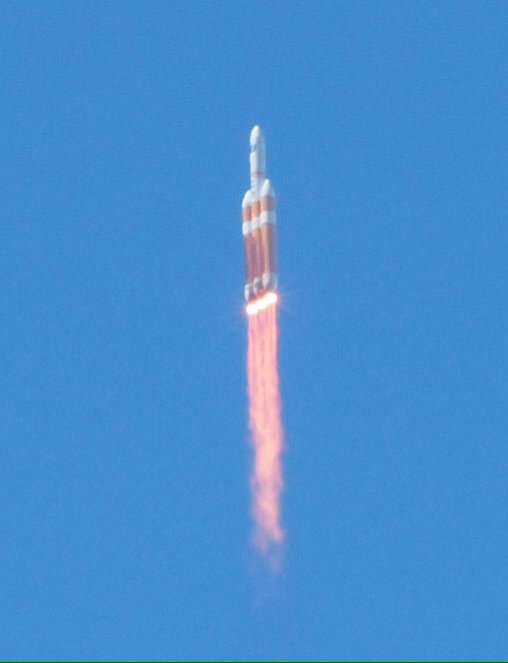
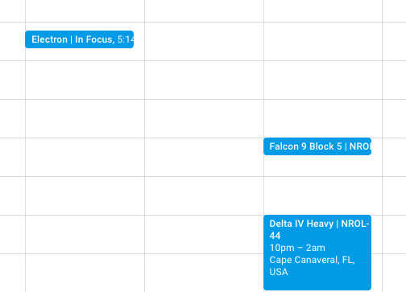
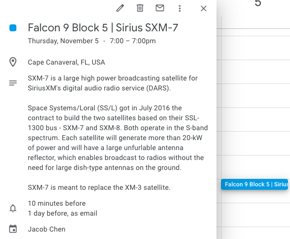

# Launch Calendar 🚀
Launch Calendar is a command-line app created in Python that searches for upcoming rocket launches and automates scheduling of them on your Google Calendar, to help you plan ahead if you would like to see it in person or make sure you don't miss the
webcast.

A rocket launch is cool enough on its own. However, one cannot truly grasp the power of these machines until a launch is watched in person. The size of the rocket. 
The blinding light of the orange exhaust. The deafening low rumble of the engines. The supersonic speeds at which it pierces through the sky.
When I watched a launch with my Dad for the first time,
it was quite an inspiring experience, and is in part why we now follow spaceflight so closely. For anyone casually interested in spaceflight, I highly recommend watching a launch in person.


###### Delta IV Launch at Vandenburg Air Force Base, California, 2013

My Dad and I try to catch rocket launches when we get the chance, both in-person and via livestreams. However, they are difficult to follow. Online schedules can often be incomplete, and launch
schedules are always changing due to weather or mechanical issues. Rocket launches are also not very publicized. Launches are hard to schedule for, and easy to miss. 

This was the motivation for Launch Calendar. It automates these things by retrieving data directly from up-to-date launch databases and 
adding them straight to your Google Calendar. Launch Calendar is helpful for quickly logging upcoming launches en masse so that you have them marked down on your
calendar before you forget, and for quickly updating your calendar to reflect sudden launch delays.

It was also a fun way to learn how to work with APIs!

# Setup
After downloading the app, for safety reasons you will need to acquire your own Google Calendar API key.
1) Go to https://developers.google.com/calendar/quickstart/python and follow step 1 to get your own API key.
- The Project Name you choose does not matter.
- When prompted, configure OAuth client for Desktop app in the dropdown menu.
2) Download the file. It should save under the filename ```credentials.json```
3) Afterwards, create a ```.env``` file in the main directory.
4) Copy over the contents of the ```.env.default``` file to your newly created ```.env``` file.
5) Open the ```credentials.json``` you downloaded in a text editor.
6) Following the format of the ```.env.default``` file you copied into ```.env```, locate the 
corresponding fields in your ```credentials.json``` and replace the variable values in ```.env``` with these new values.
    - No punctuation - just replace the entire default value with the value from ```credentials.json```

# Running the Application
1) Run main.py from your IDE or from command-line:
```python3 main.py```

2) The app will prompt you to log into your Google Account. Choose the account you would like to give the app calendar access to.
3) As of October 2020 this app has not yet been authorized, and you will see a warning. However it is not malicious.
 Click 'advanced' and proceed to allow the app to access your calendar for see/edit/share/delete access where prompted.
    - Disclaimer: the app will not delete anything from your calendar. See Usage.
    - If you encounter an error, your API key information in the ```.env``` file may be incorrect.

4) Completing authorization will create a file ```token.pickle``` in the main directory. 
    - To unauthorize your account at any time, simply delete this file.

You should be all set. Follow the prompts and input command line inputs to start browsing and scheduling upcoming launches!

# Usage
Launch Calendar lets you view upcoming spacecraft launches, sourced from the Launch Library database. 
You will be able to view the names of launch vehicles, the dates of launches, and choose whether or not to schedule
one of them on your calendar. 

### Functionality

*** Note that for safety concerns, this app will ONLY ADD calendar events or MODIFY events it has already added. There is currently
NO functionality for DELETING calendar events to prevent abuse.***

The app functions via intuitive command line prompts and inputs. Here is a sample run:
```
---Welcome to Launch Calendar!---
Launch Calendar will search for upcoming rocket launches that you can add to your Google Calendar.
First, provide search filters, if desired. Note searches are NOT case sensitive.

Filter by location: enter name of a country, or location keyword; otherwise, type 'skip'
usa

Filter by agency: enter name of a preferred agency, or agency keyword; otherwise, type 'skip'
spacex

[2] launches found:
1
Launch Vehicle: Falcon 9 Block 5 | NROL-108
Location: Cape Canaveral, FL, USA
Agency: SpaceX
Purpose of launch: Classified payload for NRO.
Launch date: 2020-10-31
Launch window (UTC): 2020-10-31T00:00:00Z -- 2020-10-31T00:00:00Z
---------------------------
2
Launch Vehicle: Falcon 9 Block 5 | Sirius SXM-7
Location: Cape Canaveral, FL, USA
Agency: SpaceX
Purpose of launch: SXM-7 is a large high power broadcasting satellite for SiriusXM's digital audio radio service (DARS).

Space Systems/Loral (SS/L) got in July 2016 the contract to build the two satellites based on their SSL-1300 bus - SXM-7 and SXM-8. Both operate in the S-band spectrum. Each satellite will generate more than 20-kW of power and will have a large unfurlable antenna reflector, which enables broadcast to radios without the need for large dish-type antennas on the ground.

SXM-7 is meant to replace the XM-3 satellite.
Launch date: 2020-11-06
Launch window (UTC): 2020-11-06T00:00:00Z -- 2020-11-06T00:00:00Z
---------------------------
Input the integer of the event you would like to add to your calendar.
Or, enter 's' to search again, or 'q' to quit.
1
Event created: https://www.google.com/calendar/event?eid=b29jaWo2MzkwMnNuOW5wdjgyNWVzb2YybjQgZWNsaXBzaXN1bWJyYTdAbQ
Created a new event for the Falcon 9 Block 5 | NROL-108 launch in your calendar on 2020-10-31.

Input the integer of the event you would like to add to your calendar.
Or, enter 's' to search again, or 'q' to quit.
2
The launch of Falcon 9 Block 5 | Sirius SXM-7 on 2020-11-06 was already detected in your calendar. Updating to most recent launch information.

Input the integer of the event you would like to add to your calendar.
Or, enter 's' to search again, or 'q' to quit.
q

Go see those launches! (if you can!!)
Thanks for using Launch Calendar. Safe flying!
```

To refine your search, the user will be given prompts to filter launches by location and agency keywords. These searches can be by
exact match, by keyword, and are not case sensitive to increase flexibility of the search function.

After finding launch events by user criteria, the app will show a numbered list of events. 

The user will be given the option to add any of them to their Google Calendar by typing in the integer of the event they would like to add. The app will handle the creation
of a new event, at the correct time based on your calendar's time zone.



The events will also be aptly named and filled with interesting information from the database!



Rocket launch schedules are fluid and face frequent delays. If the user chooses to add a launch event that has already been added to their calendar by the app, it will update the existing
calendar event with any updates in mission description and/or launch date and timing.

If the user wants to delete an event, they must delete it manually from their Google Calendar.

To unauthorize the app from accessing the user's Google account, delete the ```token.pickle``` file in the main directory.

# Credits

Launch Library 2 by The Space Devs
https://ll.thespacedevs.com/2.0.0/swagger

Google Calendar API by Google
https://developers.google.com/calendar/v3/reference

